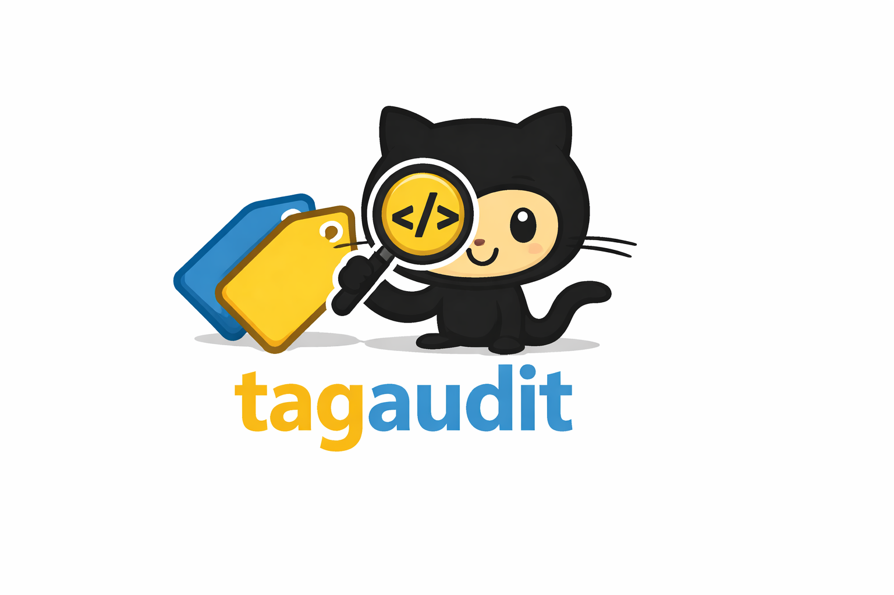

<p align="center">
  
</p>

<h1 align="center">tagaudit</h1>

[](https://github.com/emm5317/tagaudit/actions/workflows/ci.yml)
[](https://codecov.io/gh/emm5317/tagaudit)
[](https://pkg.go.dev/github.com/emm5317/tagaudit)
[](https://goreportcard.com/report/github.com/emm5317/tagaudit)
[](https://opensource.org/licenses/MIT)
[](https://github.com/emm5317/tagaudit/pulls)

A composable struct tag validation library and CLI for Go.

`tagaudit` fills the gap between `fatih/structtag` (parsing only) and `go vet` (not usable as a library). It provides a pluggable rule system with built-in rules for common issues, smart typo suggestions, auto-fix support, and user-defined custom rules.

## Install

As a library:

```bash
go get github.com/emm5317/tagaudit
```

As a standalone CLI tool:

```bash
go install github.com/emm5317/tagaudit/cmd/tagaudit@latest
```

## CLI Usage

```bash
# Analyze all packages
tagaudit ./...

# JSON output for CI
tagaudit --output json ./...

# Only show errors and warnings
tagaudit --min-severity warning ./...

# Run only specific rules
tagaudit --rules syntax,naming,options ./...

# Disable specific rules
tagaudit --disable-rules completeness ./...

# Apply auto-fixes
tagaudit --fix ./...

# Use a config file
tagaudit --config .tagaudit.yaml ./...
```

### CLI Flags

| Flag | Short | Description |
|------|-------|-------------|
| `--config` | `-c` | Path to YAML config file |
| `--output` | `-o` | Output format: `text` (default) or `json` |
| `--fix` | | Apply suggested fixes to source files |
| `--rules` | | Comma-separated rule IDs to enable |
| `--disable-rules` | | Comma-separated rule IDs to disable |
| `--min-severity` | | Minimum severity: `error`, `warning`, or `info` |

### Config File

Create a `.tagaudit.yaml`:

```yaml
rules:
  enable: [syntax, naming, duplicates, completeness, shadow, options, unknownkeys, unexported]
  disable: []

naming_conventions:
  json: snake_case
  yaml: snake_case

required_tag_keys: [json]

known_tag_keys: [json, yaml, xml, db, gorm, bson, mapstructure, toml]

known_options:
  gorm: [primaryKey, autoIncrement, column, type, size, index, unique]

min_severity: warning
```

## Library Usage

```go
package main

import (
    "fmt"

    "github.com/emm5317/tagaudit"
    "github.com/emm5317/tagaudit/rules"
)

func main() {
    a := tagaudit.New(&tagaudit.Config{
        Rules: rules.All(),
        NamingConventions: map[string]string{
            "json": "snake_case",
            "yaml": "snake_case",
        },
        RequiredTagKeys: []string{"json"},
    })

    findings, err := a.AnalyzePackages("./internal/models/...")
    if err != nil {
        panic(err)
    }

    for _, f := range findings {
        fmt.Println(f)
    }
}
```

Or use `rules.DefaultConfig()` for sensible defaults (snake_case json naming, json as required tag, default known tag keys):

```go
a := tagaudit.New(rules.DefaultConfig())
```

### Presets

Pre-configured configs for common ecosystems:

```go
// JSON-heavy codebases
cfg := rules.JSONPreset()

// API models with json + yaml + validate
cfg := rules.APIModelPreset()

// GORM models with db + gorm + json
cfg := rules.GORMPreset()
```

## Built-in Rules

| Rule | Type | What it catches |
|------|------|-----------------|
| `syntax` | per-field | Malformed struct tag strings |
| `naming` | per-field | Naming convention violations (e.g., camelCase in json tags when snake_case is expected). Provides auto-fix suggestions. |
| `options` | per-field | Invalid options for well-known tags (e.g., `json:"foo,omitemtpy"` → suggests `omitempty`). Extensible via `KnownOptions`. |
| `unexported` | per-field | Encoding tags on unexported fields (silently ignored at runtime) |
| `unknownkeys` | per-field | Tag keys not in a configured known set (e.g., `josn` → suggests `json`) |
| `completeness` | per-struct | Missing tags when other fields in the struct have them |
| `duplicates` | per-struct | Duplicate tag values within a struct, including via embedding |
| `shadow` | per-struct | Outer field tags that silently override embedded field tags |

## Custom Rules

Implement `FieldChecker` for per-field checks or `StructChecker` for cross-field checks:

```go
type MyRule struct{}

func (r *MyRule) ID() string          { return "my-rule" }
func (r *MyRule) Description() string { return "my custom rule" }

func (r *MyRule) CheckField(info tagaudit.FieldInfo, cfg *tagaudit.Config) []tagaudit.Finding {
    // your logic here
    return nil
}
```

Pass custom rules via config:

```go
a := tagaudit.New(&tagaudit.Config{
    Rules: append(rules.All(), &MyRule{}),
})
```

## go/analysis Integration

`tagaudit` provides a `go/analysis.Analyzer` for integration with golangci-lint and similar tools:

```go
import "github.com/emm5317/tagaudit"

// Use with golangci-lint or multichecker
analyzer := tagaudit.NewAnalyzer(rules.DefaultConfig())
```

## Configuration Reference

```go
&tagaudit.Config{
    // Naming conventions per tag key
    NamingConventions: map[string]string{
        "json": "snake_case",  // "snake_case", "camelCase", "PascalCase", "kebab-case"
    },

    // Require these tag keys on all exported fields if any field has them
    RequiredTagKeys: []string{"json"},

    // Only allow these tag keys (catches typos). nil = disabled.
    // Use rules.DefaultKnownTagKeys for a reasonable default set.
    KnownTagKeys: []string{"json", "db", "yaml"},

    // Register valid options for tags beyond the built-in json/xml/yaml defaults.
    KnownOptions: map[string][]string{
        "gorm": {"primaryKey", "autoIncrement", "not null"},
    },

    // Filter output by severity. nil = all findings.
    // SeverityError (0) = errors only, SeverityWarning (1) = errors+warnings, SeverityInfo (2) = all.
    MinSeverity: tagaudit.SeverityPtr(tagaudit.SeverityWarning),
}
```

## Known Limitations

- **Anonymous structs**: Only named top-level struct type declarations are analyzed. Anonymous structs in variables or function literals are not checked.
- **Type aliases**: Struct types behind type aliases may not be resolved in all cases.
- **Embedded field nuance**: The `completeness`, `duplicates`, and `shadow` rules track embedded fields, but complex multi-level embedding hierarchies may produce unexpected results. The `"-"` tag value is treated as an explicit opt-out.

## License

[MIT](LICENSE)
